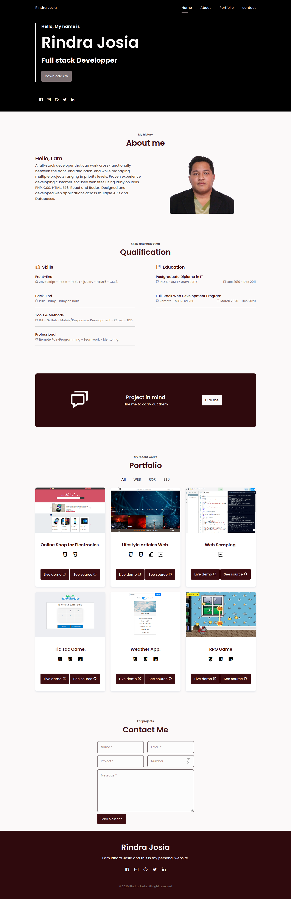

# About me
Software engineer with a strong analytical mindset and 7+ years of experience building desktop and web applications.
Studied computer science in college.
Have Bachelor's degrees in Computer Science.
Completed all of the theoretical courses for the Postgraduate Diploma in Information Technology.
Love to solve problems and challenge myself.
Currently looking for my next developer job -- feel free to contact me! (rrindrajosia@gmail.com)

# Built With
* HTML
* CSS

# Live Demo
**[Live Demo](https://rawcdn.githack.com/rindrajosia/portfolio/d1145b0943bc8ab32432871b334e5577c65f57e7/index.html)**

# Projects
* lifestyle articles
* **[Source Code](https://github.com/rindrajosia/ror-capstone)**

* Online Shop for Electronics
* **[Live Demo](https://rawcdn.githack.com/rindrajosia/capstone-html/31db66316b628f3e88ffdb63ef0798613c6382d9/index.html)**
* **[Source Code](https://github.com/rindrajosia/capstone-html)**

* Web Scraping
* **[Live Demo](https://bd42dc40-a181-4608-9fa5-e528b04c69bd.ws-eu01.gitpod.io/#/workspace/capstone-scraper)**
* **[Source Code](https://github.com/rindrajosia/capstone-scraper)**

# Authors

**Rindra Josia**

* Github: **[@rindrajosia](https://github.com/rindrajosia)**
* Twitter: **[@rindrajosia](https://twitter.com/josia_rindra)**
* Linkedin: **[linkedin](https://www.linkedin.com/in/rindra-josia-99b2111a2/)**
* Email: **[rrindrajosia@gmail.com](rrindrajosia@gmail.com)**

#  Contributing

Feel free to contact me if you want to contribute.
